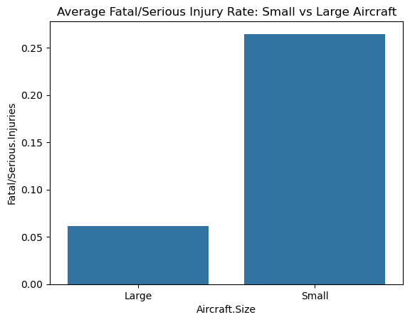
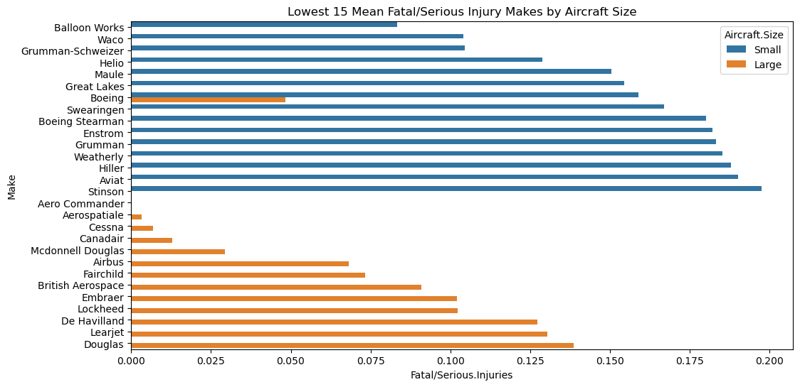
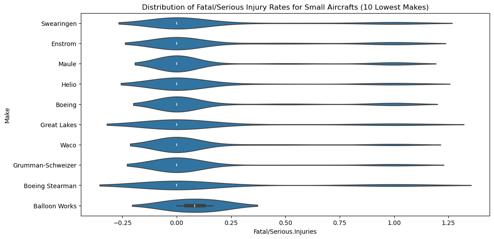
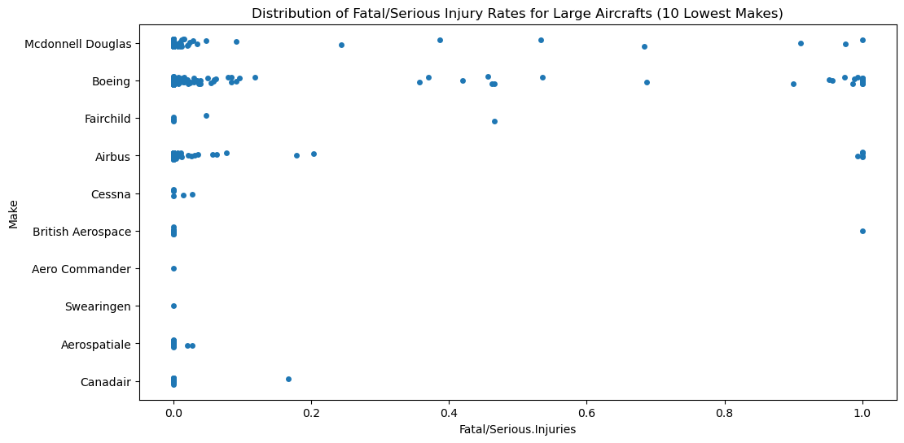
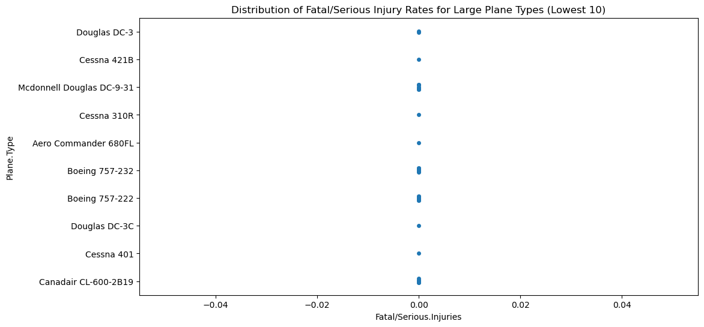
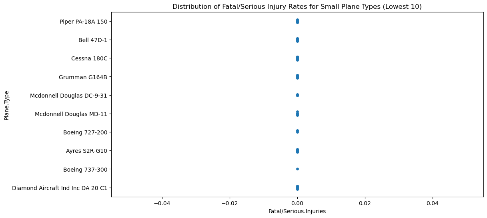
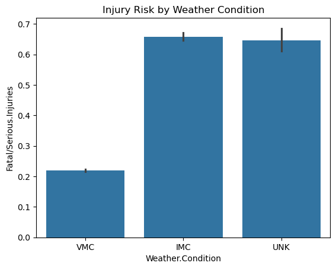
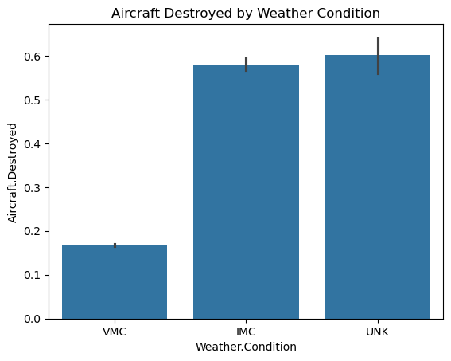
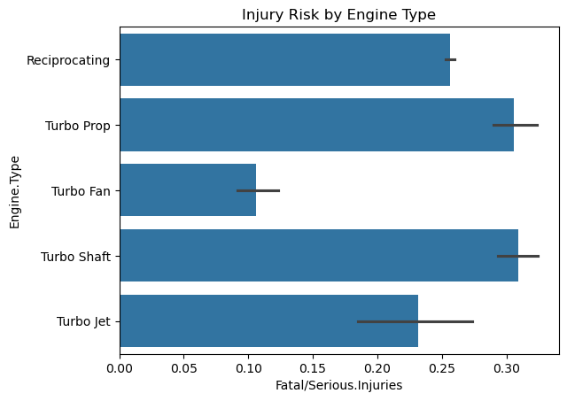
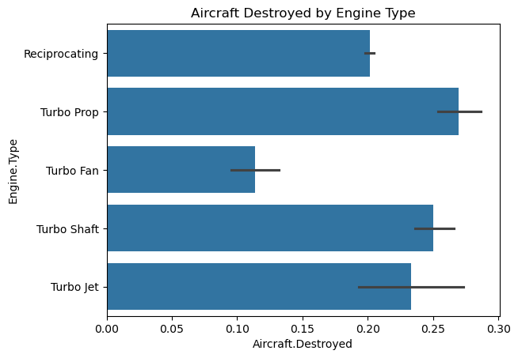

# Aviation Accident Analysis
## Overview
This project analyzes aviation accident data to identify patterns in passenger injury risk and aircraft destruction. The goal is to provide recommendations on safer aircraft manufacturers, models, and operational conditions based on historical accident outcomes.

The analysis focuses on:
- Differences between small vs. large aircrafts
- Risk variation across aircraft manufacturers (Make)
- Risk variation across aircraft types (Model / Plane Type)
- The impact of operational factors such as weather conditions and engine type

## Key Metrics
Two primary safety metrics were used:
- Fatal/Serious Injury Rate = proportion of passengers seriously or fatally injured
- Aircraft Destroyed Rate = proportion of accidents resulting in total aircraft loss

## Analysis & Findings
1. **Small vs Large Aircraft**

    Small aircrafts generally show higher variability in injury outcomes, while large aircrafts tend to have lower and more consistent injury rates.
    
    

2. **Manufacturer (Make) Analysis**
    
    Small Aircrafts
    - Manufacturers such as Balloon Works, Waco, and Grumman-Schweizer showed the lowest injury rates
    - Aircraft destruction rates were also lowest for these manufacturers

    Large Aircrafts
    - Manufacturers like Aero Commander, Swearingen, and Aerospatiale showed near-zero injury rates

    
    
    

3. **Aircraft Type (Model) Analysis**

- After filtering to models with at least 10 observations, most aircraft types showed very low injury rates (often near 0)

    
    

4. **Weather Conditions**

- VMC (Visual Meteorological Conditions) had the lowest injury and destruction rates
- IMC (Instrument Meteorological Conditions) showed higher risk, likely due to reduced visibility
- Unknown weather conditions also showed elevated risk, possibly due to incomplete reporting

    
    

5. **Engine Type**

- Turbo Fan engines had the lowest injury and destruction rates
- Turbo Prop, Turbo Shaft, and Reciprocating engines showed higher risk

    
    

6. **Conclusions**

- Prefer manufacturers with consistently low injury and destruction rates
- Aircrafts with Turbo Fan engines appear to be associated with safer outcomes
- Avoid operating in IMC conditions when possible
- Smaller aircrafts show greater variability in safety outcomes, so manufacturer choice is important in this category